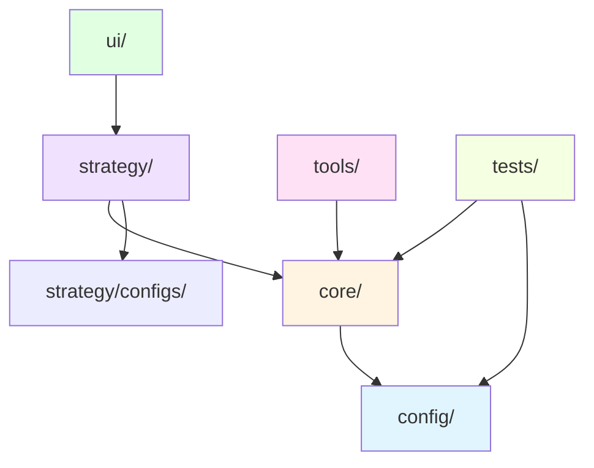

# 项目整体架构文档

> **最后更新**: 2025-11-21  
> **文档版本**: v2.0.0

## 🚀 快速参考

### 目录结构速览
```
<game>/
├── core/      # 游戏核心逻辑（纯游戏规则）
├── config/    # 游戏配置（可选）
├── strategy/  # AI策略和算法
├── ui/        # 用户界面
├── tools/     # 工具函数（可选）
└── tests/     # 测试文件（可选）
```

### 常用操作
- [查看标准目录结构](#标准目录结构)
- [查看各游戏模块详情](#各游戏模块详情)
- [查看模块依赖关系](#模块依赖关系)
- [查看开发规范](#开发规范)

## 📁 项目结构概览

本项目是一个多游戏AI训练平台，包含多个游戏实现和统一的AI训练框架。

```
majiang1/
├── src/                     # 源代码
│   ├── majiang/            # 麻将游戏
│   ├── tic-tac-toe/        # 井字棋游戏
│   ├── othello/            # 黑白棋游戏
│   ├── ai-assistant/       # AI助手框架
│   ├── ai/                 # AI框架
│   ├── shared/             # 共享代码
│   └── utils/              # 工具函数
│
├── scripts/                 # 脚本和工具
│   ├── training/           # 训练脚本
│   │   ├── majiang/       # 麻将训练脚本
│   │   ├── othello/       # 黑白棋训练脚本
│   │   └── tic-tac-toe/   # 井字棋训练脚本
│   └── demo/              # 演示脚本
│
├── docs/                    # 文档
│   ├── majiang/           # 麻将文档
│   ├── othello/           # 黑白棋文档
│   ├── tic-tac-toe/       # 井字棋文档
│   └── ARCHITECTURE.md    # 本文档
│
└── models/                  # 训练好的模型
    └── ...
```

## 🎮 游戏模块架构

所有游戏模块遵循统一的架构规范：

### 标准目录结构

```
src/<game>/
├── core/                    # 游戏核心逻辑（纯游戏规则）
│   ├── game.ts             # 游戏类和核心函数
│   ├── types.ts            # 类型定义
│   └── index.ts            # 核心模块导出
│
├── config/                  # 游戏核心配置（可选）
│   └── config.ts           # 游戏配置参数
│
├── strategy/                # AI策略和算法
│   ├── agents/             # AI智能体（推荐）
│   ├── networks/           # 神经网络（可选）
│   ├── trainers/           # 训练器（可选）
│   ├── mcts/               # MCTS算法（可选）
│   ├── configs/            # 配置管理（可选）
│   ├── utils/              # 工具函数（可选）
│   └── index.ts            # 策略模块导出（推荐）
│
├── ui/                     # 用户界面
│   ├── cli.ts              # 命令行界面（可选）
│   ├── demo.ts             # 演示程序（可选）
│   └── api-server.ts       # API服务器（可选）
│
├── tools/                  # 工具和辅助脚本（可选）
│   └── ...
│
├── tests/                  # 测试文件（可选）
│   └── ...
│
└── models/                 # 训练好的模型（可选）
    └── ...
```

### 核心原则

1. **游戏逻辑分离**：游戏核心逻辑独立于AI、UI、服务器等
2. **功能模块化**：按功能类型组织文件
3. **可扩展性**：便于添加新功能而不破坏现有结构
4. **一致性**：所有游戏模块保持一致的架构规范

## 📋 各游戏模块详情

### 1. 麻将 (majiang)

**位置**：`src/majiang/`

**特点**：
- 复杂的游戏规则和胡牌条件（40+ 种胡牌条件）
- 完整的AlphaZero AI实现（320维状态编码，39维动作解码）
- 支持人类玩家和AI玩家对弈
- 多阶段训练策略（稳定性训练、神经符号融合等）

**核心模块**：
- `core/`: 游戏核心逻辑、规则引擎、牌管理、胡牌条件
- `strategy/`: AI策略实现
  - `agents/`: AI智能体（基于规则的AI）
  - `ai-alphazero/`: AlphaZero AI完整实现（神经网络、MCTS、训练器）
- `ui/`: 显示、输入、游戏循环、事件处理
- `tools/`: 日志、性能监控
- `config/`: 游戏配置

**适用场景**：复杂规则游戏、多阶段AI训练、状态空间大的游戏

**详细架构**：参见 [docs/majiang/FOLDER_STRUCTURE.md](./majiang/FOLDER_STRUCTURE.md)

### 2. 黑白棋 (othello)

**位置**：`src/othello/`

**特点**：
- 多种AI算法实现（随机、贪心、启发式、Minimax、Q-Learning、DQN、A3C、AlphaZero）
- 完整的训练和评估框架
- 支持多种训练模式（演示、标准、高性能、生产级）
- 最规范的架构示例（推荐参考）

**核心模块**：
- `core/`: 游戏核心逻辑和类型定义
- `config/`: 游戏核心配置（棋盘大小等）
- `strategy/`: 多种AI策略实现
  - `agents/`: 各种AI智能体（8种算法）
  - `networks/`: 神经网络实现（DQN、A3C、AlphaZero）
  - `trainers/`: 训练器实现
  - `mcts/`: MCTS算法实现
  - `configs/`: 配置管理（多种预设配置）
  - `utils/`: 工具函数
- `ui/`: CLI、演示、API服务器
- `tools/`: 配置指南、程序指南
- `tests/`: 模型测试、性能测试
- `models/`: 训练好的模型

**适用场景**：中等复杂度游戏、多种AI算法对比、完整的训练框架

**详细架构**：参见 [docs/othello/FOLDER_STRUCTURE.md](./othello/FOLDER_STRUCTURE.md)

### 3. 井字棋 (tic-tac-toe)

**位置**：`src/tic-tac-toe/`

**特点**：
- 简单的游戏规则（3x3棋盘，9个位置）
- 多种AI策略（随机、贪心、Minimax、防守、Q-Learning）
- 完整的训练和评估工具
- 适合作为入门示例

**核心模块**：
- `core/`: 游戏核心逻辑和类型定义
- `strategy/`: AI策略实现和训练工具
  - `agents/`: AI智能体（5种算法）
  - `trainers/`: 训练器（Q-Learning训练）
  - `utils/`: 工具函数（Q表分析、策略可视化等）
- `ui/`: 演示程序

**适用场景**：简单游戏、快速原型、AI算法学习

**详细架构**：参见 [docs/tic-tac-toe/FOLDER_STRUCTURE.md](./tic-tac-toe/FOLDER_STRUCTURE.md)

## 🔗 模块依赖关系

### 游戏模块内部依赖



**依赖说明**：
- `config/`: 游戏核心配置，被 `core/` 使用
- `core/`: 游戏核心逻辑，被 `strategy/`、`ui/`、`tests/` 使用
- `strategy/`: AI策略实现，被 `ui/` 使用
- `strategy/configs/`: AI训练配置，被 `strategy/` 内部使用
- `tools/`: 工具函数，可被其他模块使用
- `tests/`: 测试模块，测试 `core/` 和 `config/`

**依赖方向**：`ui/ → strategy/ → core/ → config/`（单向依赖，避免循环）

### 跨模块依赖

```
scripts/training/<game>/ ──> src/<game>/
src/ai-assistant/ ──> src/<game>/
src/shared/ ──> (被所有模块共享)
src/utils/ ──> (被所有模块共享)
```

## 🛠️ 共享模块

### `src/shared/`
- 共享的类型定义和工具函数
- 被所有游戏模块使用

### `src/utils/`
- 通用工具函数
- TensorFlow.js兼容性修复等

### `src/ai-assistant/`
- AI助手框架
- 提供统一的AI辅助功能接口
- 支持视觉识别、策略分析等

### `src/ai/`
- AI框架
- 提供通用的AI算法和工具

## 📝 脚本和工具

### `scripts/training/`
- 各游戏的训练脚本
- 基准测试脚本
- 性能分析脚本

### `scripts/demo/`
- 演示脚本
- MVP工具

## 🔄 开发规范

### 文件组织
1. **核心逻辑**：放在 `core/` 目录
2. **游戏配置**：放在 `config/` 目录（游戏级配置）
3. **AI策略**：放在 `strategy/` 目录
4. **AI配置**：放在 `strategy/configs/` 目录（AI训练配置）
5. **用户界面**：放在 `ui/` 目录
6. **工具函数**：放在 `tools/` 目录
7. **测试文件**：放在 `tests/` 目录

### 导入规范
- 核心模块：`from '../core/game'`
- 游戏配置：`from '../config/config'`
- 策略模块：`from '../strategy'` 或 `from '../strategy/agents/xxx'`
- AI配置：`from '../strategy/configs/xxx'`
- UI模块：`from '../ui/xxx'`
- 工具模块：`from '../tools/xxx'`

### 导出规范
- 每个模块目录应有 `index.ts` 统一导出
- 公共API通过 `index.ts` 暴露

## 🔄 架构迁移指南

当需要将新游戏添加到项目时，请遵循以下步骤：

1. **创建标准目录结构**
   - 创建 `core/`, `strategy/`, `ui/` 目录
   - 根据需要创建 `config/`, `tools/`, `tests/`, `models/` 目录

2. **组织文件**
   - 游戏核心逻辑 → `core/`
   - 游戏配置 → `config/`
   - AI策略 → `strategy/`（按需创建子目录：agents/, networks/, trainers/, mcts/, configs/, utils/）
   - 用户界面 → `ui/`
   - 工具函数 → `tools/`
   - 测试文件 → `tests/`

3. **创建导出文件**
   - 为 `core/` 和 `strategy/` 创建 `index.ts` 统一导出

4. **更新文档**
   - 创建 `<game>/FOLDER_STRUCTURE.md` 架构文档
   - 更新本文档

## ❓ 常见问题

**Q: 应该把配置文件放在哪里？**
A: 
- 游戏核心配置（如棋盘大小、游戏规则参数）→ `config/`
- AI训练配置（如网络参数、训练超参数）→ `strategy/configs/`

**Q: 测试文件应该放在哪里？**
A: 放在 `tests/` 目录，与游戏模块同级。例如：`src/<game>/tests/`

**Q: strategy/ 子目录是必须的吗？**
A: 不是必须的，但推荐使用。如果文件较少，可以直接放在 `strategy/` 根目录。如果文件较多，建议按功能分类到子目录。

**Q: 如何保持架构一致性？**
A: 
- 遵循本文档的标准目录结构
- 参考 othello 的实现（最规范的示例）
- 新增游戏时参考架构迁移指南

**Q: 文档中列出的文件与实际不符怎么办？**
A: 
- 文档会定期更新以反映实际结构
- 如发现不一致，请及时更新文档
- 建议使用脚本自动生成文件列表（未来计划）

## 📚 相关文档

### 游戏架构文档
- [麻将架构文档](./majiang/FOLDER_STRUCTURE.md) - 复杂游戏架构示例
- [黑白棋架构文档](./othello/FOLDER_STRUCTURE.md) - 最规范的架构示例
- [井字棋架构文档](./tic-tac-toe/FOLDER_STRUCTURE.md) - 简单游戏架构示例


