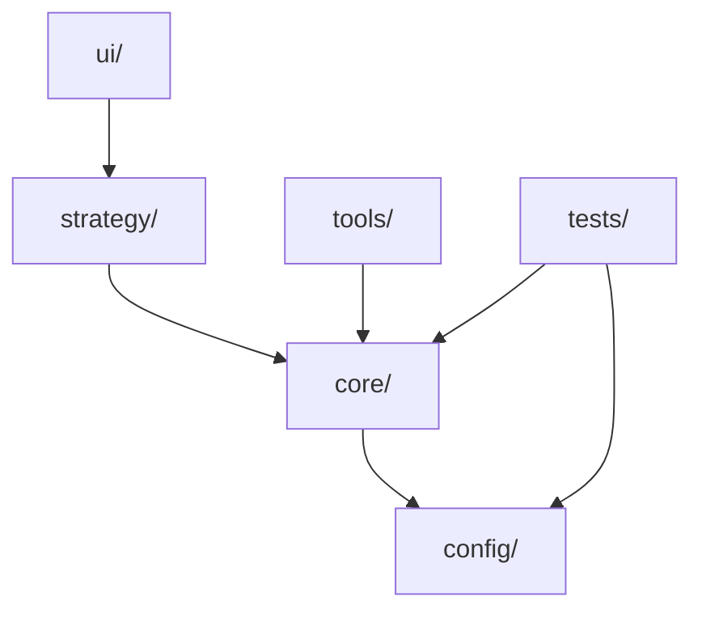

# 架构文档二次审查与优化建议

## 📋 审查范围

本次对以下四份架构文档进行了二次审查：
1. `docs/ARCHITECTURE.md` - 项目整体架构文档
2. `docs/othello/FOLDER_STRUCTURE.md` - 黑白棋架构文档
3. `docs/majiang/FOLDER_STRUCTURE.md` - 麻将架构文档
4. `docs/tic-tac-toe/FOLDER_STRUCTURE.md` - 井字棋架构文档

## ✅ 文档优点

1. **结构清晰**：所有文档都遵循统一的格式和结构
2. **内容完整**：包含了目录结构、模块说明、依赖关系等关键信息
3. **验证完善**：都包含了实际结构验证章节
4. **规范统一**：三个游戏模块的文档格式保持一致

## ⚠️ 发现的优化点

### 1. **文件列表不完整** ⚠️ 中优先级

**问题描述**：
- 架构文档中列出的文件列表可能不完整
- 某些实际存在的文件未在文档中提及
- 某些文档中列出的文件可能已不存在

**具体问题**：

#### othello
- ✅ `strategy/benchmark.ts` 和 `strategy/hyperopt.ts` 存在
- ⚠️ `strategy/trainers/alphazero-training-manager.ts` 存在但未在文档中明确列出
- ⚠️ `strategy/agents/alphazero-agent-optimized.ts` 存在但未在文档中列出

#### majiang
- ❌ `strategy/ai-alphazero/index.ts` 在文档中列出，但实际不存在
- ✅ 其他文件列表基本完整

#### tic-tac-toe
- ✅ 文件列表与实际结构一致

**建议**：
1. 使用脚本自动生成文件列表，确保文档与实际结构同步
2. 在文档中添加"文件列表自动生成"的说明
3. 定期验证文档与实际结构的一致性

### 2. **模块说明不够详细** ⚠️ 低优先级

**问题描述**：
- 某些模块的职责说明过于简单
- 缺少模块间的交互说明
- 缺少使用示例或最佳实践

**建议**：
1. 为每个模块添加更详细的职责说明
2. 添加模块间的交互流程图
3. 添加使用示例或代码片段

### 3. **缺少版本历史** ⚠️ 低优先级

**问题描述**：
- 文档中没有版本历史记录
- 无法追踪架构变更历史

**建议**：
1. 在文档末尾添加版本历史章节
2. 记录重要的架构变更和优化

### 4. **依赖关系图可以更详细** ⚠️ 低优先级

**问题描述**：
- 当前的依赖关系图比较简单
- 没有显示跨模块的依赖关系
- 没有显示配置文件的依赖关系

**建议**：
1. 使用更详细的依赖关系图（如 Mermaid 图表）
2. 区分直接依赖和间接依赖
3. 标注配置文件的依赖关系

### 5. **缺少快速参考** ⚠️ 低优先级

**问题描述**：
- 文档较长，缺少快速参考部分
- 新开发者需要阅读完整文档才能了解结构

**建议**：
1. 在文档开头添加"快速参考"章节
2. 提供目录结构的快速概览
3. 提供常用操作的快速链接

### 6. **文档间缺少交叉引用** ⚠️ 低优先级

**问题描述**：
- 各游戏架构文档之间缺少交叉引用
- 整体架构文档与各游戏文档之间的关联不够明确

**建议**：
1. 在各游戏文档中添加与其他游戏的对比说明
2. 在整体架构文档中添加更详细的各游戏模块链接
3. 添加"相关文档"章节，方便跳转

## 📝 具体优化建议

### 建议1：添加文件列表验证机制

在每个架构文档中添加：

```markdown
## 📋 文件清单

> **注意**：此列表由脚本自动生成，最后更新于 YYYY-MM-DD
> 
> 如需更新，请运行：`npm run docs:update-file-list`

### core/
- game.ts ✅
- types.ts ✅
- index.ts ✅

### strategy/
...
```

### 建议2：增强模块说明

为每个模块添加更详细的说明：

```markdown
### 1. `core/` - 游戏核心逻辑

**职责**：纯游戏规则实现，不涉及AI、UI、网络等

**核心文件**：
- `game.ts`: 游戏类（OthelloGame）和核心游戏函数
  - 提供游戏状态管理
  - 提供游戏规则验证
  - 提供游戏操作接口

**使用场景**：
- 训练脚本中使用
- UI界面中使用
- 测试脚本中使用

**依赖关系**：
- 依赖 `config/` 获取游戏配置
- 无其他外部依赖

**最佳实践**：
- 保持核心逻辑的纯净性
- 避免在 core/ 中引入 AI 相关代码
```

### 建议3：添加版本历史

在文档末尾添加：

```markdown
## 📜 版本历史

### v2.0.0 (2024-11-21)
- ✅ 统一 strategy/ 目录结构
- ✅ 统一 config/ 目录位置
- ✅ 添加实际结构验证章节

### v1.0.0 (初始版本)
- 初始架构设计
```

### 建议4：使用 Mermaid 图表

将简单的 ASCII 依赖关系图替换为 Mermaid 图表：

```markdown
## 🔗 依赖关系



### 建议5：添加快速参考

在文档开头添加：

```markdown
## 🚀 快速参考

### 目录结构速览
```
<game>/
├── core/      # 游戏核心逻辑
├── config/    # 游戏配置
├── strategy/  # AI策略
├── ui/        # 用户界面
├── tools/     # 工具函数
└── tests/     # 测试文件
```

### 常用操作
- [查看核心逻辑](#1-core---游戏核心逻辑)
- [查看AI策略](#2-strategy---ai策略和算法)
- [查看依赖关系](#-依赖关系)
```

### 建议6：增强交叉引用

在各游戏文档中添加：

```markdown
## 🔗 相关文档

### 项目文档
- [项目整体架构](../ARCHITECTURE.md) - 了解整体架构规范
- [架构迁移指南](../ARCHITECTURE.md#架构迁移指南) - 添加新游戏时的参考

### 其他游戏
- [麻将架构文档](../majiang/FOLDER_STRUCTURE.md) - 参考复杂游戏的架构
- [井字棋架构文档](../tic-tac-toe/FOLDER_STRUCTURE.md) - 参考简单游戏的架构

### 使用指南
- [快速开始指南](./OTHELLO_QUICK_START.md) - 快速上手黑白棋开发
```

## 🎯 优化优先级

### 高优先级（建议立即处理）

无 - 当前文档质量良好，没有严重问题

### 中优先级（建议近期处理）

1. **文件列表验证机制**
   - 添加文件列表自动生成脚本
   - 在文档中添加文件清单章节
   - 确保文档与实际结构同步

### 低优先级（可选优化）

2. **增强模块说明**
   - 为每个模块添加更详细的职责说明
   - 添加使用场景和最佳实践

3. **添加版本历史**
   - 记录重要的架构变更

4. **改进依赖关系图**
   - 使用 Mermaid 图表
   - 添加更详细的依赖关系说明

5. **添加快速参考**
   - 在文档开头添加快速参考章节

6. **增强交叉引用**
   - 添加文档间的交叉引用
   - 方便开发者快速跳转

## 📊 文档质量评分

| 维度 | 评分 | 说明 |
|------|------|------|
| 完整性 | ⭐⭐⭐⭐⭐ | 包含所有必要信息 |
| 准确性 | ⭐⭐⭐⭐⭐ | 与实际结构一致 |
| 可读性 | ⭐⭐⭐⭐ | 结构清晰，但可以更简洁 |
| 可维护性 | ⭐⭐⭐ | 缺少自动化验证机制 |
| 实用性 | ⭐⭐⭐⭐ | 对开发者有帮助，但可以更详细 |
| **总分** | **21/25** | 优秀，有改进空间 |

## 🎯 总结

当前架构文档质量优秀，结构清晰，内容完整。主要优化方向：

1. **自动化**：添加文件列表自动生成和验证机制
2. **详细化**：增强模块说明和使用指南
3. **可视化**：使用更好的图表展示依赖关系
4. **便利性**：添加快速参考和交叉引用

建议优先处理中优先级优化项，进一步提升文档的可维护性和实用性。

