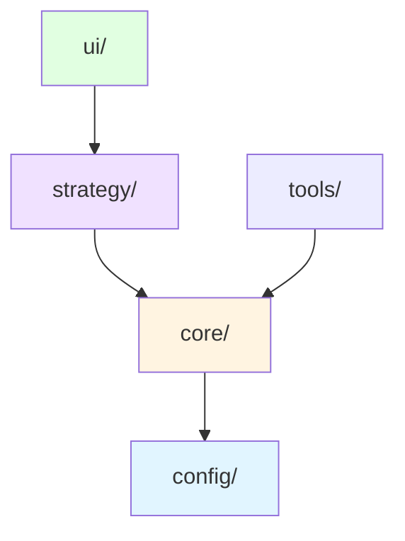

# 麻将项目架构文档

> **最后更新**: 2024-11-21  
> **文档版本**: v2.0.0

## 📁 目录结构

### 核心原则
1. **游戏逻辑分离**：游戏核心逻辑独立于AI、UI、服务器等
2. **功能模块化**：按功能类型组织文件
3. **可扩展性**：便于添加新功能而不破坏现有结构
4. **一致性**：与项目中其他游戏（黑白棋、井字棋）保持一致的规范

## 🗂️ 标准目录结构

```
src/majiang/
├── core/                    # 游戏核心逻辑（纯游戏规则，不涉及AI）
│   ├── game.ts             # 游戏类（Game）和核心逻辑
│   ├── rule-engine.ts      # 规则引擎
│   ├── rule-types.ts       # 规则类型定义
│   ├── tile.ts             # 牌类
│   ├── tile-manager.ts     # 牌管理器
│   ├── player.ts           # 玩家基类
│   ├── score-calculator.ts # 分数计算器
│   ├── win-conditions/     # 胡牌条件
│   │   ├── index.ts
│   │   ├── win-condition-detector.ts
│   │   └── win-conditions_*.ts (各种胡牌条件)
│   ├── types.ts            # 类型定义
│   └── index.ts            # 核心模块导出
│
├── strategy/                # AI策略和算法
│   ├── agents/             # AI智能体
│   │   └── ai-player.ts   # AI玩家实现
│   ├── ai-alphazero/       # AlphaZero AI实现
│   │   ├── majiang-alphazero-agent.ts
│   │   ├── majiang-alphazero-network.ts
│   │   ├── majiang-alphazero-network-tf.ts
│   │   ├── majiang-game-adapter.ts
│   │   ├── majiang-state-encoder.ts
│   │   ├── majiang-action-decoder.ts
│   │   ├── self-play-trainer.ts
│   │   ├── real-self-play-trainer.ts
│   │   ├── phase2-stability-trainer.ts
│   │   ├── phase3-neurosymbolic-trainer.ts
│   │   ├── phase4-super-optimizer.ts
│   │   ├── stability-optimizer.ts
│   │   ├── neural-symbolic-fusion.ts
│   │   ├── performance-config.ts
│   │   ├── integration-test.ts
│   │   ├── demo.ts
│   │   └── types.ts
│   └── index.ts            # 策略模块导出
│
├── ui/                     # 用户界面相关
│   ├── display.ts          # 显示相关
│   ├── display-manager.ts  # 显示管理器
│   ├── input.ts            # 输入处理
│   ├── gameLoop.ts         # 游戏循环
│   ├── game-event-handler.ts # 游戏事件处理
│   ├── countdown-manager.ts  # 倒计时管理器
│   └── human-player.ts     # 人类玩家
│
├── tools/                  # 工具和辅助脚本
│   ├── logger.ts           # 日志工具
│   ├── performance-monitor.ts # 性能监控
│   ├── performance-injector.ts # 性能注入器
│   └── time-utils.ts       # 时间工具
│
├── config/                 # 配置文件
│   └── config.ts           # 游戏配置
│
└── index.ts                # 主入口文件
```

## 📋 模块说明

### 1. `core/` - 游戏核心逻辑

**职责**：纯游戏规则实现，不涉及AI、UI、网络等

**核心文件**：
- `game.ts`: 游戏类（Game）和核心游戏逻辑
  - 游戏状态管理、回合控制、游戏流程
- `rule-engine.ts`: 规则引擎，处理游戏规则
  - 吃、碰、杠、胡等操作的规则验证
- `rule-types.ts`: 规则相关的类型定义
- `tile.ts`: 牌类定义
  - 牌的类型、花色、数值等
- `tile-manager.ts`: 牌管理器
  - 牌的生成、洗牌、发牌等
- `player.ts`: 玩家基类
  - 玩家状态、手牌管理、动作接口
- `score-calculator.ts`: 分数计算器
  - 胡牌后的分数计算
- `win-conditions/`: 各种胡牌条件实现
  - 40+ 种胡牌条件的检测和计算
- `types.ts`: 游戏相关的类型定义
- `index.ts`: 核心模块的统一导出

**使用场景**：
- 训练脚本：提供游戏环境进行AI训练
- UI界面：渲染游戏状态和处理用户输入
- 测试脚本：验证游戏规则的正确性

**依赖关系**：
- 依赖 `config/` 获取游戏配置
- 无其他外部依赖

**最佳实践**：
- 保持核心逻辑的纯净性，不引入 AI 相关代码
- 规则引擎应该是可扩展的，便于添加新的胡牌条件
- 游戏状态应该是可序列化的，便于保存和恢复

### 2. `strategy/` - AI策略和算法

**职责**：所有AI相关的实现

**核心子目录**：
- `agents/`: AI智能体
  - `ai-player.ts`: 基于规则的AI玩家实现
    - 使用启发式策略进行决策
- `ai-alphazero/`: AlphaZero AI完整实现
  - `majiang-alphazero-agent.ts`: AlphaZero 智能体
  - `majiang-alphazero-network.ts`: 神经网络实现
  - `majiang-state-encoder.ts`: 状态编码（320维）
  - `majiang-action-decoder.ts`: 动作解码（39维）
  - `majiang-game-adapter.ts`: 游戏适配器
  - 多个训练器：self-play、real-self-play、phase2-4 等

**使用场景**：
- 训练脚本：使用训练器进行模型训练
- UI界面：使用 agents/ 提供AI对手
- 评估脚本：评估AI性能

**依赖关系**：
- 依赖 `core/` 模块获取游戏逻辑
- 依赖 `config/` 了解游戏配置

**最佳实践**：
- AI 实现应该通过适配器与游戏核心交互
- 状态编码应该包含所有必要的游戏信息
- 训练器应该支持多阶段训练策略

### 3. `ui/` - 用户界面

**职责**：用户交互相关的代码

**核心文件**：
- `display.ts`: 显示相关功能
  - 游戏状态的视觉化展示
- `display-manager.ts`: 显示管理器
  - 统一管理所有显示相关操作
- `input.ts`: 输入处理
  - 用户输入的解析和验证
- `gameLoop.ts`: 游戏主循环
  - 游戏流程控制和状态更新
- `game-event-handler.ts`: 游戏事件处理
  - 处理游戏中的各种事件
- `countdown-manager.ts`: 倒计时管理
  - 玩家思考时间的倒计时
- `human-player.ts`: 人类玩家实现
  - 处理人类玩家的输入和操作

**使用场景**：
- 终端用户：通过 UI 进行游戏
- 开发者：测试游戏功能
- 演示：展示游戏和AI功能

**依赖关系**：
- 依赖 `core/` 模块获取游戏逻辑
- 依赖 `strategy/` 模块获取AI智能体

**最佳实践**：
- UI 层应该薄，主要逻辑在 core/ 和 strategy/
- 提供清晰的用户反馈和错误提示

### 4. `tools/` - 工具和辅助脚本
**职责**：辅助工具、日志、性能监控等
- `logger.ts`: 日志工具
- `performance-monitor.ts`: 性能监控
- `performance-injector.ts`: 性能注入器
- `time-utils.ts`: 时间工具函数

### 5. `config/` - 配置文件
**职责**：游戏配置
- `config.ts`: 游戏配置参数

## 🔗 依赖关系



**依赖说明**：
- `config/` 提供游戏配置，被 `core/` 使用
- `core/` 提供游戏核心逻辑，被 `strategy/` 和 `ui/` 使用
- `strategy/` 提供AI策略，被 `ui/` 使用
- `tools/` 提供工具函数，可被其他模块使用

**依赖方向**：`ui/ → strategy/ → core/ → config/`（单向依赖，避免循环）

## 📋 文件清单

> **注意**：此列表由脚本自动生成，最后更新于 2025-11-21
> 
> 如需更新，请运行：`npm run docs:update-file-list`

### core/

- `core/game.ts` ✅
- `core/index.ts` ✅
- `core/player.ts` ✅
- `core/rule-engine.ts` ✅
- `core/rule-types.ts` ✅
- `core/score-calculator.ts` ✅
- `core/tile-manager.ts` ✅
- `core/tile.ts` ✅
- `core/types.ts` ✅
- `core/win-conditions/index.ts` ✅
- `core/win-conditions/win-condition-detector.ts` ✅
- `core/win-conditions/win-conditions-main.ts` ✅
- `core/win-conditions/win-conditions_all-even-pungs.ts` ✅
- `core/win-conditions/win-conditions_all-fives.ts` ✅
- `core/win-conditions/win-conditions_all-green.ts` ✅
- `core/win-conditions/win-conditions_all-high-numbers.ts` ✅
- `core/win-conditions/win-conditions_all-honors.ts` ✅
- `core/win-conditions/win-conditions_all-low-numbers.ts` ✅
- `core/win-conditions/win-conditions_all-terminals.ts` ✅
- `core/win-conditions/win-conditions_all-types.ts` ✅
- `core/win-conditions/win-conditions_big-four-winds.ts` ✅
- `core/win-conditions/win-conditions_big-three-dragons.ts` ✅
- `core/win-conditions/win-conditions_concealed-hand.ts` ✅
- `core/win-conditions/win-conditions_double-concealed-kongs.ts` ✅
- `core/win-conditions/win-conditions_eight-flowers.ts` ✅
- `core/win-conditions/win-conditions_four-concealed-pungs.ts` ✅
- `core/win-conditions/win-conditions_four-flowers.ts` ✅
- `core/win-conditions/win-conditions_four-kongs.ts` ✅
- `core/win-conditions/win-conditions_four-of-a-kind.ts` ✅
- `core/win-conditions/win-conditions_fully-isolated.ts` ✅
- `core/win-conditions/win-conditions_half-flush.ts` ✅
- `core/win-conditions/win-conditions_knitted-straight.ts` ✅
- `core/win-conditions/win-conditions_kong-flower.ts` ✅
- `core/win-conditions/win-conditions_last-tile.ts` ✅
- `core/win-conditions/win-conditions_mixed-straight.ts` ✅
- `core/win-conditions/win-conditions_mixed-terminals.ts` ✅
- `core/win-conditions/win-conditions_nine-gates.ts` ✅
- `core/win-conditions/win-conditions_one-voided-suit.ts` ✅
- `core/win-conditions/win-conditions_outside-hand.ts` ✅
- `core/win-conditions/win-conditions_peng-peng-hu.ts` ✅
- `core/win-conditions/win-conditions_ping-hu.ts` ✅
- `core/win-conditions/win-conditions_pure-double-chow.ts` ✅
- `core/win-conditions/win-conditions_pure-same-chow.ts` ✅
- `core/win-conditions/win-conditions_pure-shifted-chows.ts` ✅
- `core/win-conditions/win-conditions_pure-shifted-pungs.ts` ✅
- `core/win-conditions/win-conditions_pure-straight.ts` ✅
- `core/win-conditions/win-conditions_pure-terminal-chow.ts` ✅
- `core/win-conditions/win-conditions_qing-yi-se.ts` ✅
- `core/win-conditions/win-conditions_reversible-tiles.ts` ✅
- `core/win-conditions/win-conditions_robbing-kong.ts` ✅
- `core/win-conditions/win-conditions_seven-connected-pairs.ts` ✅
- `core/win-conditions/win-conditions_seven-pairs.ts` ✅
- `core/win-conditions/win-conditions_seven-stars.ts` ✅
- `core/win-conditions/win-conditions_small-four-winds.ts` ✅
- `core/win-conditions/win-conditions_small-three-dragons.ts` ✅
- `core/win-conditions/win-conditions_thirteen-orphans.ts` ✅
- `core/win-conditions/win-conditions_three-kongs.ts` ✅
- `core/win-conditions/win-conditions_three-similar-pungs.ts` ✅
- `core/win-conditions/win-conditions_three-similar-sequences.ts` ✅
- `core/win-conditions/win-conditions_two-concealed-pungs.ts` ✅
- `core/win-conditions/win-conditions_two-dragon-pungs.ts` ✅
- `core/win-conditions/win-conditions_two-identical-pungs.ts` ✅

### config/

- `config/config.ts` ✅

### strategy/

- `strategy/agents/ai-player.ts` ✅
- `strategy/ai-alphazero/demo.ts` ✅
- `strategy/ai-alphazero/integration-test.ts` ✅
- `strategy/ai-alphazero/majiang-action-decoder.ts` ✅
- `strategy/ai-alphazero/majiang-alphazero-agent.ts` ✅
- `strategy/ai-alphazero/majiang-alphazero-network-tf.ts` ✅
- `strategy/ai-alphazero/majiang-alphazero-network.ts` ✅
- `strategy/ai-alphazero/majiang-game-adapter.ts` ✅
- `strategy/ai-alphazero/majiang-state-encoder.ts` ✅
- `strategy/ai-alphazero/neural-symbolic-fusion.ts` ✅
- `strategy/ai-alphazero/performance-config.ts` ✅
- `strategy/ai-alphazero/phase2-stability-trainer.ts` ✅
- `strategy/ai-alphazero/phase3-neurosymbolic-trainer.ts` ✅
- `strategy/ai-alphazero/phase4-super-optimizer.ts` ✅
- `strategy/ai-alphazero/real-self-play-trainer.ts` ✅
- `strategy/ai-alphazero/self-play-trainer.ts` ✅
- `strategy/ai-alphazero/stability-optimizer.ts` ✅
- `strategy/ai-alphazero/types.ts` ✅
- `strategy/index.ts` ✅

### ui/

- `ui/countdown-manager.ts` ✅
- `ui/display-manager.ts` ✅
- `ui/display.ts` ✅
- `ui/game-event-handler.ts` ✅
- `ui/gameLoop.ts` ✅
- `ui/human-player.ts` ✅
- `ui/input.ts` ✅

### tools/

- `tools/logger.ts` ✅
- `tools/performance-injector.ts` ✅
- `tools/performance-monitor.ts` ✅
- `tools/time-utils.ts` ✅

### 根目录

- `index.ts` ✅


## 📊 实际结构验证

本文档最后更新于：2024-11-21  
实际文件结构已验证：✅

**验证内容**：
- ✅ 所有目录结构符合文档描述
- ✅ strategy/ 子目录已创建（agents/, ai-alphazero/）
- ✅ 所有文件已移动到正确位置
- ✅ 导入路径已更新
- ✅ config/ 目录已存在并包含游戏配置

