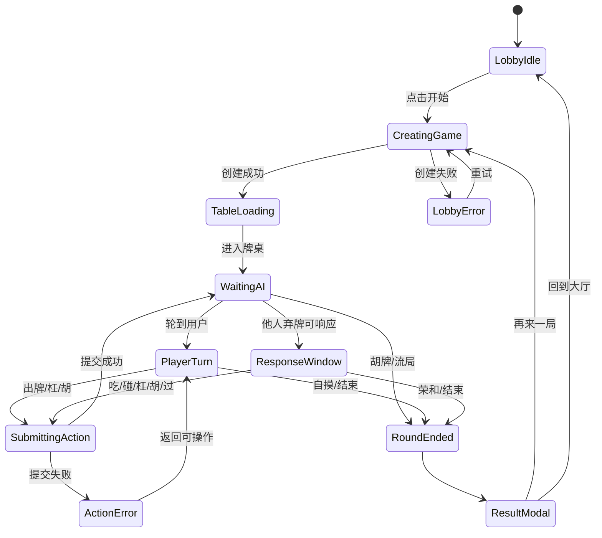

# 麻将 Web UI 产品交互设计补充文档

> **文档定位**：补充麻将 Web UI 的产品级交互与视觉设计要求。  
> **适用阶段**：MVP 后续 UI/UX 质量提升、前端实现拆分、验收用例补齐。  
> **不替代内容**：不重写麻将核心规则，不改变 CLI 交互，不替代 `src/majiang/core/` 与 `src/majiang/strategy/` 的业务实现。  
> **规范依据**：`AGENTS.md`、`docs/standards/rules/development.md`、`docs/majiang/FOLDER_STRUCTURE.md`。

## 1. 背景与目标

现有麻将 Web UI 设计材料已经能约束 MVP 技术落地：保留核心规则、保护 CLI 路径、跑通 Lobby / Table / ResultModal。但它更偏技术设计与验收矩阵，缺少足够细的产品交互说明，无法指导“好用、好看、能看懂局势”的 UI 改版。

本补充文档的目标是把 Web UI 从“可运行”推进到“可理解、可操作、可复盘”：

- 用户能在 3 秒内看懂当前轮到谁、自己能做什么、为什么能做。
- 用户能在 1 局内形成稳定空间记忆：自己手牌在底部，其他玩家围绕牌桌，牌河与动作流清晰可追踪。
- 用户能在关键节点获得明确反馈：等待 AI、可出牌、可响应、错误、忙碌、结束结算。
- 开发者能通过诊断/复盘入口确认前端展示与后端状态是否一致。
- Web UI 只做表现与交互编排，规则判断仍来自 `src/majiang/core/`，AI 决策仍来自 `src/majiang/strategy/`，符合 `docs/majiang/FOLDER_STRUCTURE.md` 的 UI 层薄原则。

## 2. 产品体验原则

### 2.1 信息层级

1. **主任务优先**：当前玩家、当前动作、可操作按钮、自己手牌永远位于最高层级。
2. **局势可读**：最近动作、弃牌来源、响应原因、分数变化必须可见，不依赖用户猜。
3. **细节渐进展示**：默认只显示必要信息；完整日志、规则判定、AI 思考细节放入诊断抽屉。
4. **避免规则重写**：所有“能否吃/碰/杠/胡/出牌”的可用性由后端/核心状态提供，前端不得自行推导替代。
5. **CLI 不受影响**：Web UI 新增状态、动效、诊断入口不得改动现有 CLI 的输出路径与输入流程。

### 2.2 视觉气质

推荐方向：**现代桌游感 + 清晰工具感**。

- 牌桌：深绿色或墨绿色圆角桌面，强调“游戏空间”。
- 牌面：偏真实麻将牌的白/象牙色，高对比牌字，避免过度拟物导致识别困难。
- 信息面板：半透明深色玻璃卡片或浅色卡片均可，但同一版本需统一。
- 动效：轻量、短促、帮助理解来源与结果；避免长动画阻塞操作。
- 密度：桌面端信息完整，移动端优先保留当前操作与手牌，次要信息折叠。

## 3. 页面范围与角色

### 3.1 Lobby

**核心目标**：让用户快速开始一局，并理解本局配置。

必须包含：

- 新建对局入口：默认一名人类玩家 + AI 对手。
- 对局配置摘要：玩家数、AI 类型、规则集、起始分。
- 最近对局入口：可选；若未实现，应保留空状态文案。
- 诊断入口：进入最近日志/自检结果，便于开发验收。

交互要求：

- 点击“开始对局”后进入 busy 状态，按钮显示“创建中...”。
- 创建失败时保留当前配置并展示重试按钮。
- 配置未开放编辑时，明确标注“当前版本固定配置”。

### 3.2 Table

**核心目标**：让用户稳定理解局势并完成操作。

必须包含：

- 中央牌桌区：展示牌山余量、最近弃牌、当前轮次、当前行动玩家。
- 四方座位区：展示玩家名、风位/座位、分数、手牌数量、已公开副露、最近动作。
- 自己手牌区：底部固定，支持选牌、出牌、可操作提示。
- 操作区：出牌、吃、碰、杠、胡、过、确认/取消。
- 事件流：展示最近 5-8 条局内事件。
- 诊断入口：展示状态快照、动作日志、错误上下文。

### 3.3 ResultModal

**核心目标**：让用户看懂为什么结束、谁赢了、分数怎么变。

必须包含：

- 结果标题：自摸、荣和、流局、异常终止。
- 赢家/点炮者：若存在点炮，明确标记来源。
- 胡牌原因：胡牌牌型、番种/分值来源、触发牌。
- 分数变化：每名玩家本局变化与累计分。
- 操作入口：再来一局、回到大厅、查看复盘。

## 4. 桌面布局规范

### 4.1 断点

| 断点 | 宽度 | 布局策略 |
| --- | --- | --- |
| Desktop-L | ≥ 1280px | 完整四方牌桌 + 右侧信息栏 |
| Desktop-M | 1024-1279px | 完整牌桌 + 可折叠信息栏 |
| Tablet | 768-1023px | 压缩座位信息 + 底部操作优先 |
| Mobile | < 768px | 纵向布局，保留自己手牌和操作区，其他信息折叠 |

### 4.2 桌面端空间比例

推荐画布比例：

- 顶部状态栏：8%-10% 高度。
- 中央牌桌：54%-62% 高度。
- 自己手牌与操作区：24%-30% 高度。
- 右侧信息栏：280-360px 宽度，展示事件流、诊断摘要、规则提示。

四方座位层级：

- 自己：底部最大，手牌可读，操作按钮贴近。
- 对家：顶部中等，突出最近动作与弃牌。
- 左/右家：两侧压缩，突出名称、分数、手牌数、副露。
- 当前行动玩家：座位外圈高亮，附加呼吸光或短促描边动画。

### 4.3 移动端布局

移动端必须牺牲“全量同时可见”，但不能牺牲“当前可操作性”：

1. 顶部：局势摘要，包含当前玩家、牌山余量、最近动作。
2. 中部：牌桌简化区，显示弃牌区与其他玩家状态。
3. 底部：自己手牌固定吸底，操作按钮紧贴手牌上方。
4. 抽屉：事件流、完整玩家信息、诊断日志进入底部抽屉或右滑面板。

移动端底部安全区：

- 操作按钮需避开系统 Home Indicator。
- 手牌横向滚动时必须保留选中态，不因滚动丢失。
- 不建议依赖 hover；所有提示必须能通过点击/长按触发。

## 5. 视觉规格

### 5.1 牌桌

| 元素 | 桌面建议 | 移动建议 |
| --- | --- | --- |
| 牌桌圆角 | 28-40px | 20-28px |
| 桌面内边距 | 24-32px | 12-16px |
| 中央状态牌 | 180-260px 宽 | 140-180px 宽 |
| 当前玩家高亮 | 2-3px 描边 + 轻阴影 | 2px 描边 |

### 5.2 牌面

| 牌面类型 | 桌面尺寸 | 移动尺寸 | 说明 |
| --- | --- | --- | --- |
| 自己手牌 | 44x64 到 52x76px | 34x50 到 42x60px | 最高识别优先级 |
| 他人暗牌 | 24x38 到 32x48px | 18x30 到 24x38px | 只表达数量 |
| 弃牌/牌河 | 28x40 到 34x48px | 22x32 到 28x40px | 支持来源标记 |
| 副露牌 | 32x46 到 40x56px | 24x36 到 32x44px | 需分组展示 |

牌面状态：

- 默认：象牙白底、深色牌字。
- 可出：轻微上浮或底部亮线。
- 已选：上浮 8-12px，增加主色描边。
- 不可出：降低不透明度到 45%-60%，不可仅靠颜色表达。
- 刚摸牌：短促入场动画，持续 160-240ms。
- 最近打出：牌河中附加来源角标与 1.5-2 秒高亮。

### 5.3 色彩语义

| 语义 | 推荐色 | 使用范围 |
| --- | --- | --- |
| 主行动 | 金色/琥珀色 | 出牌、确认、当前行动提示 |
| 安全/完成 | 绿色 | 操作成功、结算正收益 |
| 警告/可响应 | 橙色 | 可吃碰杠胡、倒计时临近 |
| 危险/错误 | 红色 | 失败、断线、非法操作 |
| 信息/诊断 | 蓝色 | 日志、状态快照、复盘入口 |
| 中性 | 灰色 | 次要文本、不可操作状态 |

颜色不得成为唯一信息来源；按钮、标签、图标、文案需共同表达状态。

## 6. 交互状态设计

### 6.1 全局状态机



### 6.2 状态清单

| 状态 | 用户看到 | 用户可做 | 禁止事项 |
| --- | --- | --- | --- |
| LobbyIdle | 开始入口、配置摘要 | 开始对局、查看诊断 | 不展示未生效配置为可编辑 |
| CreatingGame | 创建中按钮、骨架屏 | 取消或等待 | 不允许重复创建多局 |
| TableLoading | 牌桌骨架、加载文案 | 等待 | 不展示半初始化手牌 |
| WaitingAI | 当前 AI 思考中、座位高亮 | 查看日志/复盘入口 | 不允许用户提前出牌 |
| PlayerTurn | 自己手牌高亮、可出牌提示 | 选牌、出牌、可用特殊操作 | 不允许前端自行判断非法牌可出 |
| ResponseWindow | 弃牌来源、响应原因、倒计时 | 吃/碰/杠/胡/过 | 不隐藏“过” |
| SubmittingAction | 操作按钮 loading | 等待、取消仅在接口支持时开放 | 不允许连续提交相同动作 |
| ActionError | 错误原因、重试/返回 | 重试、重新选择、查看诊断 | 不吞错误、不只写 console |
| RoundEnded | 牌桌锁定、进入结算 | 查看结果 | 不允许继续操作手牌 |
| ResultModal | 胡牌/流局原因、分数变化 | 再来一局、回大厅、复盘 | 不只显示胜负，不解释分数 |

### 6.3 倒计时与忙碌态

- AI 思考超过 600ms：显示“AI 思考中...”。
- 动作提交超过 800ms：按钮进入 loading，其他互斥操作禁用。
- 响应窗口剩余 5 秒：倒计时变为警告样式。
- 操作失败：toast + 操作区内联错误同时出现；toast 自动消失，内联错误保留到下一次有效操作。
- 断线/状态同步失败：桌面顶部展示全局错误条，提供重试与诊断入口。

## 7. 用户局势理解设计

### 7.1 最近动作

必须在牌桌中央或右侧事件流展示最近动作：

格式建议：

- `东家 AI-1 打出 三万`
- `你 碰了 AI-2 的 六筒`
- `AI-3 杠 九条，摸补牌`
- `你 胡牌：平胡 + 自摸`

最近动作视觉要求：

- 最近 1 条在牌桌中央短暂强化，1.5-2 秒后降级进入事件流。
- 弃牌应标记来源玩家。
- 响应动作应连接“被响应的牌”和“响应玩家”，可用箭头/连线/同色标签。

### 7.2 响应原因

当出现吃/碰/杠/胡时，操作区不只给按钮，还要解释原因：

- 吃：`可吃：四万 + 五万 + 六万`
- 碰：`可碰：你已有两张 六筒`
- 杠：`可杠：四张 九条`
- 胡：`可胡：满足 平胡，预计 +8`

若核心状态暂未提供完整原因，前端应展示保守文案：

- `核心规则判定可胡，详情见诊断`

禁止前端为了展示原因而重写完整规则判断；原因字段应作为后端/适配层输出的一部分逐步补齐。

### 7.3 分数变化

分数展示分三层：

1. 座位卡片：当前总分。
2. 事件流：本次动作带来的即时分数变化。
3. 结算弹窗：完整本局分数表。

ResultModal 分数表字段：

| 玩家 | 本局变化 | 总分 | 角色 | 原因 |
| --- | --- | --- | --- | --- |
| 你 | +24 | 124 | 赢家 | 自摸 / 平胡 |
| AI-1 | -8 | 92 | 放分 | 自摸支付 |
| AI-2 | -8 | 96 | 放分 | 自摸支付 |
| AI-3 | -8 | 88 | 放分 | 自摸支付 |

### 7.4 可操作提示

操作区必须回答三个问题：

- **现在轮到谁？** 例如：`轮到你出牌`、`等待 AI-2 出牌`。
- **我能做什么？** 例如：`请选择一张手牌打出`、`你可以碰/胡，也可以过`。
- **为什么？** 例如：`AI-1 刚打出 六筒，你已有两张 六筒`。

## 8. 诊断与复盘入口

### 8.1 诊断面板

入口位置：

- 桌面端：右侧信息栏底部固定“诊断”按钮。
- 移动端：顶部更多菜单或底部抽屉入口。
- ResultModal：显示“查看复盘/诊断”。

诊断面板内容：

- 当前状态快照：roundId、turnIndex、currentPlayer、phase、wallCount。
- 最近动作日志：最近 20 条 action/event。
- 前端渲染摘要：选中牌、可用动作、禁用原因。
- 错误上下文：请求参数、响应错误码、可重试建议。
- 导出入口：复制 JSON / 下载日志。若未实现下载，至少支持复制。

### 8.2 复盘视图

复盘入口应在 ResultModal 中开放，MVP 阶段可先实现为只读时间线。

复盘最小能力：

- 按时间线展示摸牌、出牌、吃碰杠胡、分数变化。
- 支持跳到关键节点：首次响应、胡牌、错误、流局。
- 支持从某一事件查看当时四家状态摘要。

非目标：

- 不要求 MVP 阶段支持任意回滚重放。
- 不要求用户从复盘中恢复对局。
- 不要求复盘推演 AI 决策依据，除非策略层已提供解释字段。

## 9. 组件设计建议

### 9.1 组件边界

| 组件 | 职责 | 不应承担 |
| --- | --- | --- |
| `LobbyPage` | 创建对局、展示配置与入口 | 麻将规则判断 |
| `TablePage` | 组织牌桌布局、订阅状态 | 直接计算胡牌 |
| `SeatView` | 展示玩家座位、分数、副露、动作 | 修改玩家状态 |
| `TileView` | 展示单张牌与交互状态 | 判断牌是否合法 |
| `HandView` | 手牌选择、排序、出牌触发 | 推导可响应动作 |
| `ActionBar` | 展示可用动作与原因 | 自行构造核心动作 |
| `EventTimeline` | 展示动作流和分数变化 | 替代日志系统 |
| `ResultModal` | 展示结算与后续入口 | 重新结算分数 |
| `DiagnosticsPanel` | 展示状态与错误上下文 | 修改核心状态 |

### 9.2 状态字段建议

Web UI 适配层建议输出一个只读视图模型：

```ts
interface MajiangTableViewModel {
  gameId: string;
  phase: 'loading' | 'waiting_ai' | 'player_turn' | 'response_window' | 'submitting' | 'ended' | 'error';
  currentPlayerId?: string;
  wallCount: number;
  seats: SeatViewModel[];
  selfHand: TileViewModel[];
  discardRiver: DiscardViewModel[];
  availableActions: ActionViewModel[];
  latestEvent?: GameEventViewModel;
  eventTimeline: GameEventViewModel[];
  scoreDelta?: ScoreDeltaViewModel[];
  diagnostics: DiagnosticsSummaryViewModel;
}
```

要求：

- 视图模型由适配层聚合，组件只消费，不反向修改。
- 可用动作必须带 `disabledReason` 或 `reasonText`。
- 错误状态必须带 `recoverable` 与 `retryAction` 描述。
- 结算信息必须来自核心结算结果，不允许前端重新计算。

## 10. 可访问性与易用性

- 所有按钮需有可读文本，不仅依赖图标。
- 牌面需提供 aria-label，例如 `三万`、`东风`、`红中`。
- 当前选中牌需同时通过位置、描边、文本/提示表达。
- 键盘操作建议：方向键移动选牌，Enter 出牌，Esc 取消，数字键选择动作。
- 色弱可读：红/绿收益亏损需配合 `+` / `-`、箭头或文字。
- 动效需尊重系统减少动态效果设置。

## 11. 验收矩阵

| 场景 | 验收点 |
| --- | --- |
| 创建对局 | Lobby 展示 busy，成功进入 Table，失败可重试 |
| 等待 AI | 当前 AI 座位高亮，用户操作禁用，事件流不丢失 |
| 用户出牌 | 可选手牌有明确选中态，提交后进入 loading，成功更新牌河 |
| 可响应 | 展示弃牌来源、响应按钮、响应原因、倒计时和“过” |
| 非法操作 | 不崩溃，展示错误原因，可回到上一可操作状态 |
| 胡牌结束 | ResultModal 展示赢家、胡牌原因、分数变化、再来一局 |
| 流局结束 | ResultModal 明确流局原因与分数处理 |
| 移动端 | 手牌和操作区可用，事件流可通过抽屉查看 |
| 诊断入口 | 能查看当前状态、最近动作、错误上下文 |
| CLI 保护 | Web UI 改造不改变现有 CLI 测试与路径 |

## 12. 实施拆分建议

### Phase 1：交互骨架补齐

- 建立 Lobby / Table / ResultModal 的稳定布局。
- 定义 `MajiangTableViewModel` 适配层。
- 接入全局 phase 状态和可用动作展示。
- 添加基本事件流与诊断面板。

### Phase 2：局势理解增强

- 补齐最近动作强化展示。
- 增加响应原因、分数变化、弃牌来源标记。
- 优化错误、重试、忙碌、倒计时状态。
- 完成移动端抽屉与底部手牌体验。

### Phase 3：产品级 polish

- 统一视觉主题、牌面尺寸、动效节奏。
- 增加复盘时间线。
- 增加键盘操作和无障碍标签。
- 根据真实对局日志补齐异常态设计。

## 13. 非目标与边界

- 不在 Web UI 中重新实现胡牌/吃碰杠规则。
- 不在本阶段重构 CLI。
- 不要求 MVP 阶段实现联机多人。
- 不要求 MVP 阶段实现完整 AI 决策解释。
- 不要求前端独立保存可恢复对局，除非核心层提供稳定序列化能力。

## 14. 与现有规范的关系

- 依据 `docs/standards/rules/development.md`：本设计保持游戏核心逻辑、AI 策略、UI 表现分层，不把业务规则搬进 UI。
- 依据 `docs/majiang/FOLDER_STRUCTURE.md`：Web UI 仍属于 UI 层职责，只负责渲染游戏状态和处理用户输入。
- 依据 `AGENTS.md`：本文优先引用 `docs/standards/` 与麻将目录结构正文，不以 IDE 私有规则替代共享规范。
- 当前未发现规范冲突；若后续具体实现与 CLI 或核心规则产生冲突，应优先保护核心规则与 CLI 既有行为。
