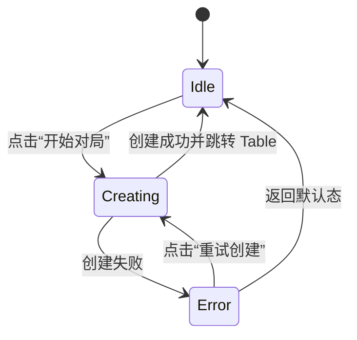
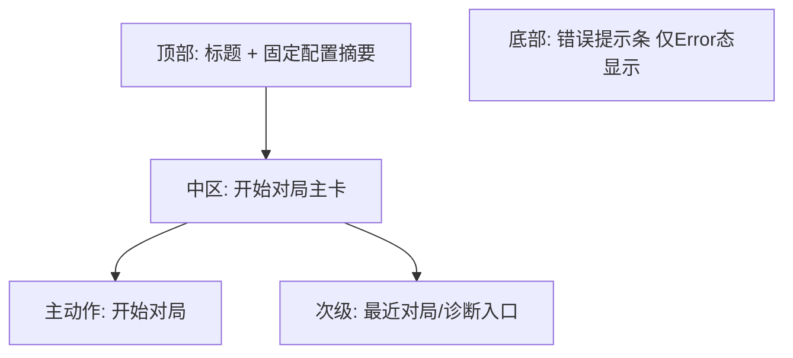
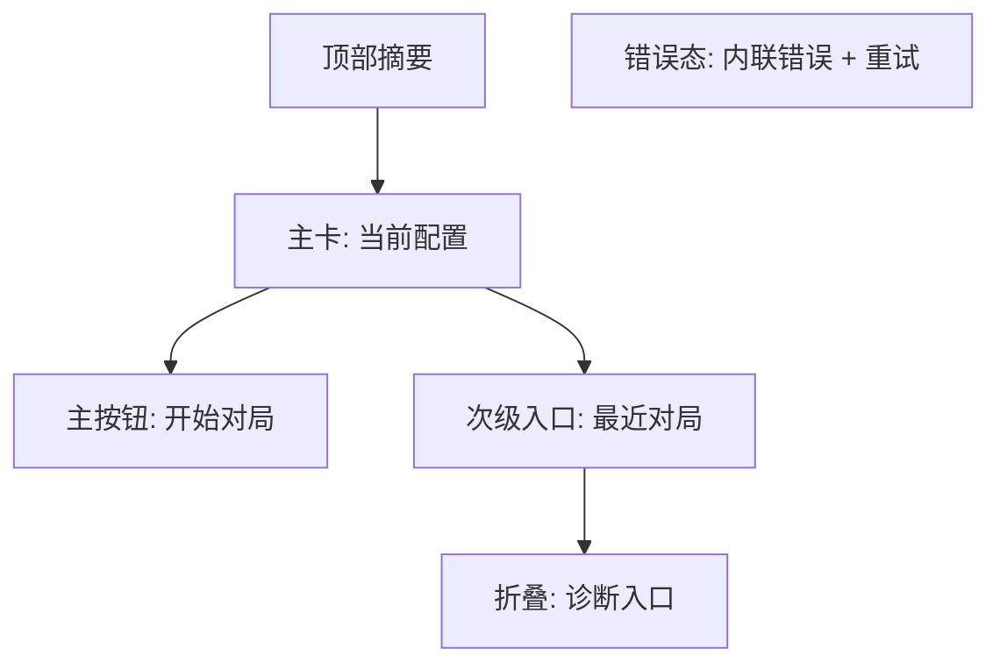

# Lobby 状态图样冻结

```mermaid
stateDiagram-v2
    [*] --> Idle
    Idle --> Creating: 点击“开始对局”
    Creating --> Idle: 创建成功并跳转 Table
    Creating --> Error: 创建失败
    Error --> Creating: 点击“重试创建”
    Error --> Idle: 返回默认态
```

## 桌面图样（Desktop-L / Desktop-M）

```mermaid
flowchart TB
    A[顶部: 标题 + 固定配置摘要] --> B[中区: 开始对局主卡]
    B --> C[主动作: 开始对局]
    B --> D[次级: 最近对局/诊断入口]
    E[底部: 错误提示条 仅Error态显示]
```

## 移动图样（Tablet / Mobile）

```mermaid
flowchart TB
    A[顶部摘要] --> B[主卡: 当前配置]
    B --> C[主按钮: 开始对局]
    B --> D[次级入口: 最近对局]
    D --> E[折叠: 诊断入口]
    F[错误态: 内联错误 + 重试]
```

## 状态表达
- Idle：仅一个强主动作 `开始对局`。
- Creating：主按钮进入忙碌态，文案为 `创建中...`，禁用次级入口。
- Error：保留上次配置，主动作改为 `重试创建`，错误原因文本固定在主卡底部。
