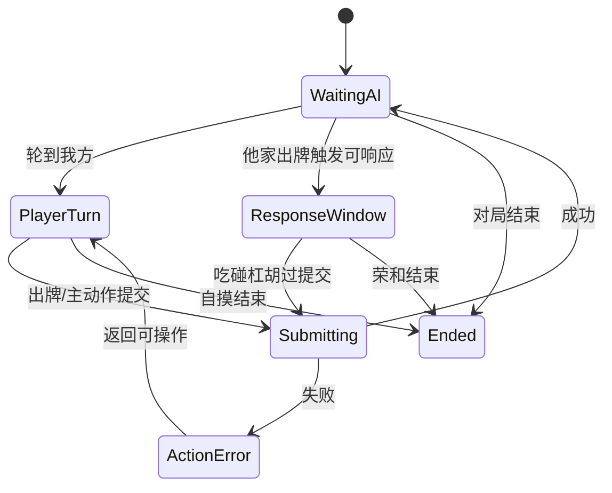
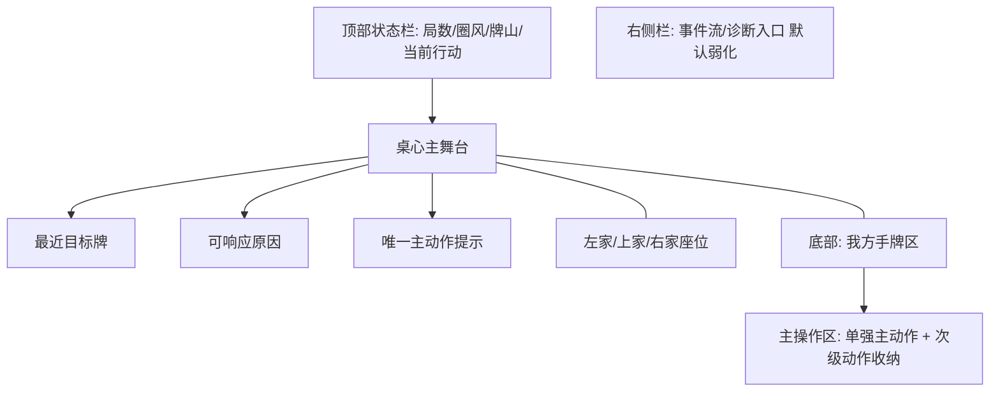
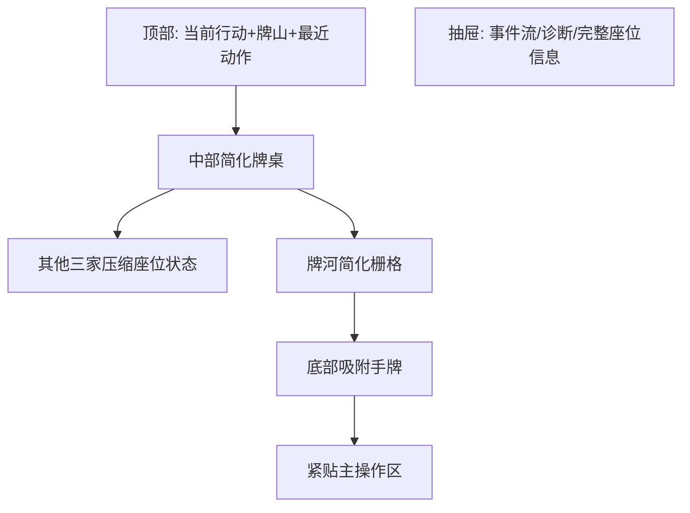

# Table 状态图样冻结（桌面+移动）

## Desktop-L/M 结构图样

## Mobile 结构图样

## 状态到UI映射
- WaitingAI：桌心显示 `等待AI动作`，主操作区仅保留 `过(禁用)` 占位。
- PlayerTurn：手牌可选，默认强主动作为 `出牌`。
- ResponseWindow：默认强主动作为 `过`，仅当选中可执行动作时主动作切换到对应动作。
- Submitting：冻结按钮与手牌点击，桌心显示提交进度。
- ActionError：内联错误条 + 自动回到上一次可操作态，保留上下文牌。
- Ended：主操作区隐藏，仅保留 `查看结果` 入口。
