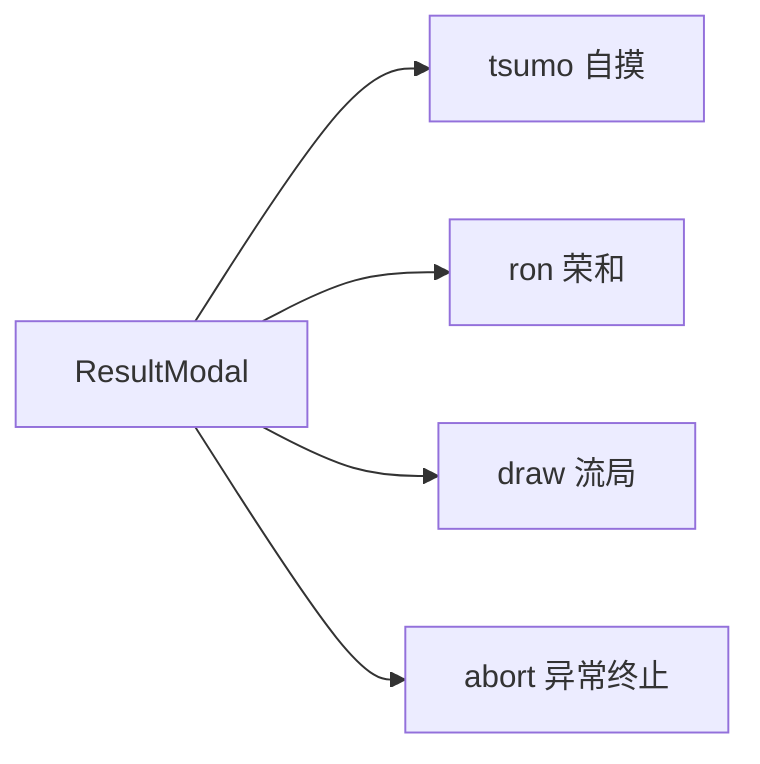
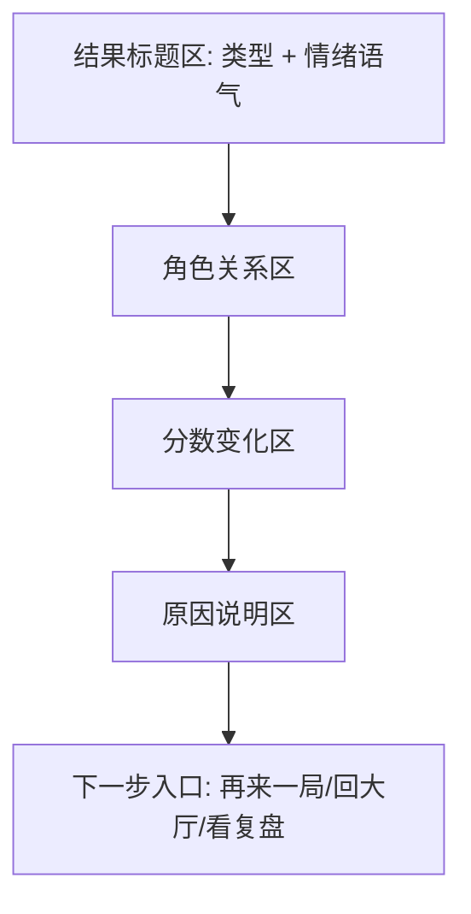

# ResultModal 四类型图样冻结

## 通用结构（四类型一致）

## 类型差异
- tsumo：突出“赢家 vs 三家共同支付关系”。
- ron：并列突出“赢家 + 点炮者 + 其余两家”。
- draw：突出“流局原因 + 各家分数微调/不变”。
- abort：突出“终止原因 + 本局是否计分 + 重开建议”。

## 必备解释字段
- 谁赢：赢家名称与座位。
- 为什么：触发牌、番种/分值来源（来自核心层）。
- 分数如何变化：四家 `本局变化` 与 `累计分`。
