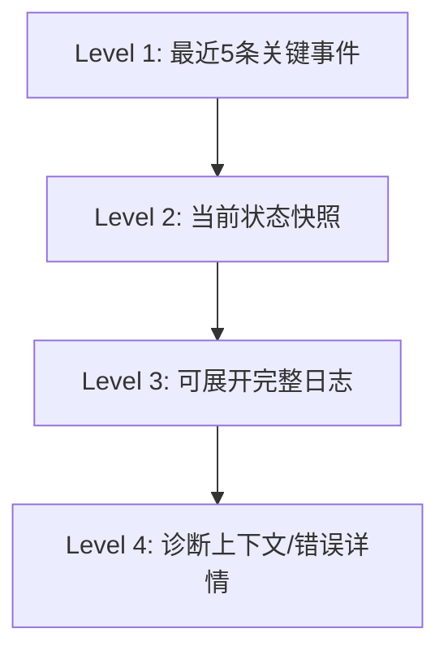

# Replay / Diagnostics 入口态冻结

## 默认弱化态（首屏）

```mermaid
flowchart LR
    A[桌心主舞台 100%优先] --> B[右侧栏折叠标签: 复盘/诊断]
    B --> C[低对比图标 + 次级文字]
```

## 展开后信息层级

```mermaid
flowchart TB
    A[Level 1: 最近5条关键事件] --> B[Level 2: 当前状态快照]
    B --> C[Level 3: 可展开完整日志]
    C --> D[Level 4: 诊断上下文/错误详情]
```

## 交互约束
- 默认不抢主视觉，不出现大面积高对比块。
- 展开后可滚动查看，但不挤压底部手牌主可达区。
- 移动端使用底部抽屉，支持单手关闭返回主桌面。
