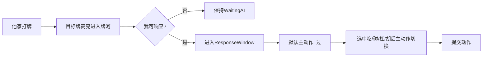
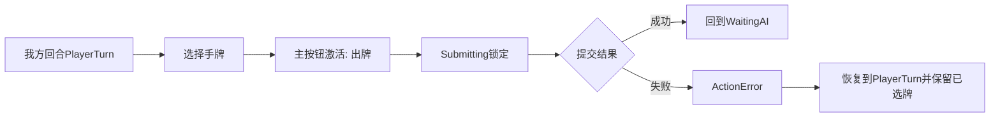
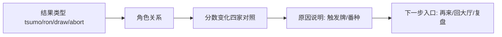

# 关键链路图（阶段A冻结）

## 链路1：谁打牌 -> 目标牌 -> 我可响应 -> 主动作执行

```mermaid
flowchart LR
    A[他家打牌] --> B[目标牌高亮进入牌河]
    B --> C{我可响应?}
    C -->|否| D[保持WaitingAI]
    C -->|是| E[进入ResponseWindow]
    E --> F[默认主动作: 过]
    F --> G[选中吃/碰/杠/胡后主动作切换]
    G --> H[提交动作]
```

## 链路2：选牌 -> 出牌 -> 提交中 -> 成功/失败恢复

```mermaid
flowchart LR
    A[我方回合PlayerTurn] --> B[选择手牌]
    B --> C[主按钮激活: 出牌]
    C --> D[Submitting锁定]
    D --> E{提交结果}
    E -->|成功| F[回到WaitingAI]
    E -->|失败| G[ActionError]
    G --> H[恢复到PlayerTurn并保留已选牌]
```

## 链路3：结算弹窗解释链

```mermaid
flowchart LR
    A[结果类型 tsumo/ron/draw/abort] --> B[角色关系]
    B --> C[分数变化四家对照]
    C --> D[原因说明: 触发牌/番种]
    D --> E[下一步入口: 再来/回大厅/复盘]
```
