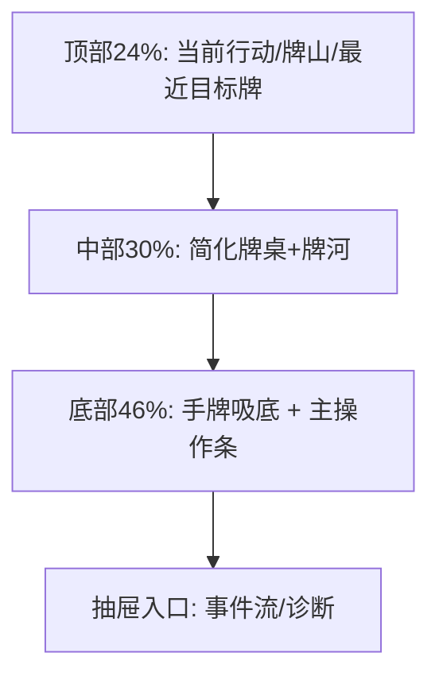
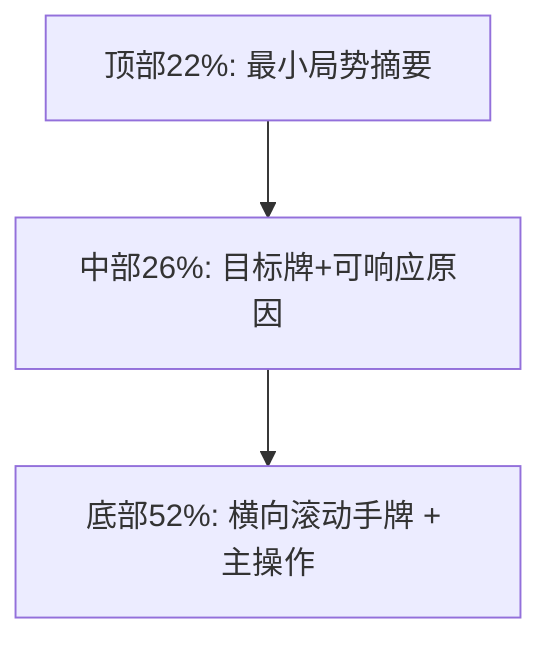

# 极限断点补图（360px / 320px）

## 目标
- 在不破坏阶段A主链路的前提下，确保超小屏依旧可完成“选牌->主动作提交->状态反馈”。
- 不新增规则，不改变CLI路径，仅补充布局冻结细节。

## 360px 图样

### 360px 冻结约束
- 手牌尺寸降至 `34x50`，牌间距 `5-6px`。
- 主按钮高度保持 `44px`，仅保留一个强主按钮。
- 次级动作进入 `更多操作` 抽屉，避免并列挤压。
- 牌河最多显示最近 `8` 张，历史进入抽屉查看。

## 320px 图样

### 320px 冻结约束
- 手牌尺寸降至 `30x44`，但点击热区保持 `44x44`（以透明点击层实现）。
- 手牌区固定横向滚动，选中态不得因滚动丢失。
- ResponseWindow 默认主动作固定为 `过`，可执行动作选中后替换主按钮。
- 禁止展示右侧栏；事件与诊断仅底部抽屉承载。

## 超小屏可用性闸门
- 3秒内可判断当前轮到谁。
- 3秒内可找到并执行唯一主动作。
- 结果弹窗仍能解释“谁赢、为什么、分数变化”。
