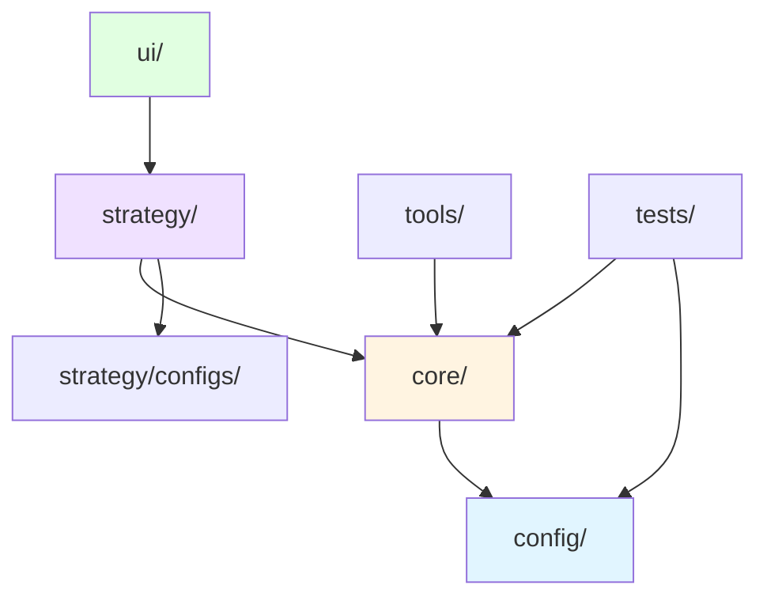

# 黑白棋项目架构文档

> **最后更新**: 2024-11-21  
> **文档版本**: v2.0.0

## 📁 目录结构

### 核心原则
1. **游戏逻辑分离**：游戏核心逻辑独立于AI、UI、服务器等
2. **功能模块化**：按功能类型组织文件
3. **可扩展性**：便于添加新功能而不破坏现有结构
4. **一致性**：与项目中其他游戏（麻将、井字棋）保持一致的规范

## 🗂️ 标准目录结构

```
src/othello/
├── core/                    # 游戏核心逻辑（纯游戏规则，不涉及AI）
│   ├── game.ts             # 游戏类（OthelloGame）和核心函数
│   ├── types.ts            # 类型定义
│   └── index.ts            # 核心模块导出
│
├── config/                  # 游戏核心配置
│   └── config.ts           # 游戏配置参数
│
├── strategy/                # AI策略和算法
│   ├── agents/             # AI智能体
│   │   ├── random-agent.ts
│   │   ├── greedy-agent.ts
│   │   ├── heuristic-agent.ts
│   │   ├── minimax-agent.ts
│   │   ├── qlearning-agent.ts
│   │   ├── dqn-agent.ts
│   │   ├── a3c-agent.ts
│   │   ├── alphazero-agent.ts
│   │   └── alphazero-agent-optimized.ts
│   ├── networks/           # 神经网络实现
│   │   ├── dqn-network.ts
│   │   ├── a3c-network.ts
│   │   ├── alphazero-network.ts
│   │   └── alphazero-network-advanced.ts
│   ├── trainers/           # 训练器
│   │   ├── dqn-trainer.ts
│   │   ├── a3c-trainer.ts
│   │   ├── alphazero-trainer.ts
│   │   ├── alphazero-trainer-optimized.ts
│   │   └── alphazero-training-manager.ts
│   ├── mcts/               # MCTS相关
│   │   ├── alphazero-mcts.ts
│   │   └── alphazero-mcts-optimized.ts
│   ├── configs/            # 配置相关
│   │   ├── alphazero-configs.ts
│   │   └── alphazero-configs-advanced.ts
│   ├── utils/              # 工具函数
│   │   ├── strategy-utils.ts
│   │   ├── experience-replay.ts
│   │   └── rng.ts
│   ├── benchmark.ts        # 基准测试
│   ├── hyperopt.ts         # 超参数优化
│   └── index.ts            # 策略模块导出
│
├── ui/                     # 用户界面相关
│   ├── cli.ts              # 命令行界面
│   ├── demo.ts             # 演示程序
│   └── api-server.ts       # API服务器
│
├── tools/                  # 工具和辅助脚本
│   ├── config-guide.ts     # 配置指南
│   ├── program-guide.ts    # 程序指南
│   └── run-commands.ts     # 命令运行工具
│
├── tests/                  # 测试文件
│   ├── model-test.ts       # 模型测试
│   └── performance-test.ts # 性能测试
│
└── models/                 # 训练好的模型
    └── ...
```

## 📋 模块说明

### 1. `core/` - 游戏核心逻辑

**职责**：纯游戏规则实现，不涉及AI、UI、网络等

**核心文件**：
- `game.ts`: 游戏类（OthelloGame）和核心游戏函数
  - 提供游戏状态管理
  - 提供游戏规则验证（落子合法性、游戏结束判断）
  - 提供游戏操作接口（创建棋盘、执行落子、计算胜负）
- `types.ts`: 游戏相关的类型定义
  - `OthelloBoard`: 棋盘状态类型
  - `OthelloPlayer`: 玩家类型（'B' 或 'W'）
  - `OthelloAction`: 动作类型（行、列坐标）
- `index.ts`: 核心模块的统一导出

**使用场景**：
- 训练脚本中使用：提供游戏环境
- UI界面中使用：渲染游戏状态
- 测试脚本中使用：验证游戏逻辑

**依赖关系**：
- 依赖 `config/` 获取游戏配置（棋盘大小等）
- 无其他外部依赖

**最佳实践**：
- 保持核心逻辑的纯净性，不引入 AI 相关代码
- 所有函数应该是纯函数或类方法，便于测试
- 游戏状态应该是不可变的，操作返回新状态

### 2. `config/` - 游戏核心配置

**职责**：游戏核心配置参数

**核心文件**：
- `config.ts`: 游戏配置
  - `BOARD_SIZE`: 棋盘大小（8x8）
  - `INITIAL_PIECES`: 初始棋子数量
  - `MAX_MOVES`: 最大步数限制

**使用场景**：
- `core/` 模块使用：获取游戏规则参数
- `strategy/` 模块使用：了解游戏规模
- 测试脚本使用：验证配置正确性

**依赖关系**：
- 无依赖，是配置常量定义

**最佳实践**：
- 配置应该是常量，运行时不可修改
- 区分游戏配置和AI训练配置（AI配置在 `strategy/configs/`）

### 3. `strategy/` - AI策略和算法

**职责**：所有AI相关的实现

**核心子目录**：
- `agents/`: 各种AI智能体实现
  - 随机、贪心、启发式、Minimax、Q-Learning、DQN、A3C、AlphaZero 等
- `networks/`: 神经网络实现
  - DQN、A3C、AlphaZero 网络架构
- `trainers/`: 训练器实现
  - 各种算法的训练循环和优化
- `mcts/`: MCTS算法实现
  - AlphaZero 使用的蒙特卡洛树搜索
- `configs/`: AI训练配置管理
  - 不同场景的配置预设（演示、标准、高性能、生产级）
- `utils/`: 工具函数
  - 策略工具、经验回放、随机数生成等

**使用场景**：
- 训练脚本：使用 trainers/ 进行模型训练
- UI界面：使用 agents/ 提供AI对手
- 评估脚本：使用 benchmark.ts 进行性能评估

**依赖关系**：
- 依赖 `core/` 模块获取游戏逻辑
- 依赖 `config/` 了解游戏配置
- `strategy/configs/` 被 strategy/ 内部使用

**最佳实践**：
- 保持 agents/ 接口统一，实现 `OthelloAgent` 接口
- 训练配置与游戏配置分离
- 使用 `index.ts` 统一导出公共API

### 4. `ui/` - 用户界面

**职责**：用户交互相关的代码

**核心文件**：
- `cli.ts`: 命令行界面
  - 提供终端交互式游戏体验
- `demo.ts`: 演示程序
  - 快速演示游戏和AI功能
- `api-server.ts`: HTTP API服务器
  - 提供 RESTful API 接口

**使用场景**：
- 终端用户：通过 CLI 或 API 进行游戏
- 开发者：使用 demo 快速测试功能
- 集成：通过 API 集成到其他系统

**依赖关系**：
- 依赖 `core/` 模块获取游戏逻辑
- 依赖 `strategy/` 模块获取AI智能体

**最佳实践**：
- UI 层应该薄，主要逻辑在 core/ 和 strategy/
- 提供清晰的错误处理和用户提示

### 5. `tools/` - 工具和辅助脚本
**职责**：辅助工具、指南、配置等
- `config-guide.ts`: 配置指南
- `program-guide.ts`: 程序指南
- `run-commands.ts`: 命令运行工具

### 6. `tests/` - 测试文件
**职责**：各种测试脚本
- `model-test.ts`: 模型测试
- `performance-test.ts`: 性能测试

### 7. `models/` - 训练好的模型
**职责**：存储训练好的模型文件

## 🔗 依赖关系



**依赖说明**：
- `config/` 提供游戏配置，被 `core/` 使用
- `core/` 提供游戏核心逻辑，被 `strategy/`、`ui/` 和 `tests/` 使用
- `strategy/` 提供AI策略，被 `ui/` 使用
- `strategy/configs/` 提供AI训练配置，被 `strategy/` 内部使用
- `tools/` 提供工具函数，可被其他模块使用
- `tests/` 测试 `core/` 和 `config/` 模块

**依赖方向**：`ui/ → strategy/ → core/ → config/`（单向依赖，避免循环）

## 📋 文件清单

> **注意**：此列表由脚本自动生成，最后更新于 2025-11-21
> 
> 如需更新，请运行：`npm run docs:update-file-list`

### core/

- `core/game.ts` ✅
- `core/index.ts` ✅
- `core/types.ts` ✅

### config/

- `config/config.ts` ✅

### strategy/

- `strategy/agents/a3c-agent.ts` ✅
- `strategy/agents/alphazero-agent-optimized.ts` ✅
- `strategy/agents/alphazero-agent.ts` ✅
- `strategy/agents/dqn-agent.ts` ✅
- `strategy/agents/greedy-agent.ts` ✅
- `strategy/agents/heuristic-agent.ts` ✅
- `strategy/agents/minimax-agent.ts` ✅
- `strategy/agents/qlearning-agent.ts` ✅
- `strategy/agents/random-agent.ts` ✅
- `strategy/benchmark.ts` ✅
- `strategy/configs/alphazero-configs-advanced.ts` ✅
- `strategy/configs/alphazero-configs.ts` ✅
- `strategy/hyperopt.ts` ✅
- `strategy/index.ts` ✅
- `strategy/mcts/alphazero-mcts-optimized.ts` ✅
- `strategy/mcts/alphazero-mcts.ts` ✅
- `strategy/networks/a3c-network.ts` ✅
- `strategy/networks/alphazero-network-advanced.ts` ✅
- `strategy/networks/alphazero-network.ts` ✅
- `strategy/networks/dqn-network.ts` ✅
- `strategy/trainers/a3c-trainer.ts` ✅
- `strategy/trainers/alphazero-trainer-optimized.ts` ✅
- `strategy/trainers/alphazero-trainer.ts` ✅
- `strategy/trainers/alphazero-training-manager.ts` ✅
- `strategy/trainers/dqn-trainer.ts` ✅
- `strategy/utils/experience-replay.ts` ✅
- `strategy/utils/rng.ts` ✅
- `strategy/utils/strategy-utils.ts` ✅

### ui/

- `ui/api-server.ts` ✅
- `ui/cli.ts` ✅
- `ui/demo.ts` ✅

### tools/

- `tools/config-guide.ts` ✅
- `tools/program-guide.ts` ✅
- `tools/run-commands.ts` ✅

### tests/

- `tests/model-test.ts` ✅
- `tests/performance-test.ts` ✅

## core/

- `core/game.ts` ✅
- `core/index.ts` ✅
- `core/types.ts` ✅

### config/

- `config/config.ts` ✅

### strategy/

- `strategy/agents/a3c-agent.ts` ✅
- `strategy/agents/alphazero-agent-optimized.ts` ✅
- `strategy/agents/alphazero-agent.ts` ✅
- `strategy/agents/dqn-agent.ts` ✅
- `strategy/agents/greedy-agent.ts` ✅
- `strategy/agents/heuristic-agent.ts` ✅
- `strategy/agents/minimax-agent.ts` ✅
- `strategy/agents/qlearning-agent.ts` ✅
- `strategy/agents/random-agent.ts` ✅
- `strategy/benchmark.ts` ✅
- `strategy/configs/alphazero-configs-advanced.ts` ✅
- `strategy/configs/alphazero-configs.ts` ✅
- `strategy/hyperopt.ts` ✅
- `strategy/index.ts` ✅
- `strategy/mcts/alphazero-mcts-optimized.ts` ✅
- `strategy/mcts/alphazero-mcts.ts` ✅
- `strategy/networks/a3c-network.ts` ✅
- `strategy/networks/alphazero-network-advanced.ts` ✅
- `strategy/networks/alphazero-network.ts` ✅
- `strategy/networks/dqn-network.ts` ✅
- `strategy/trainers/a3c-trainer.ts` ✅
- `strategy/trainers/alphazero-trainer-optimized.ts` ✅
- `strategy/trainers/alphazero-trainer.ts` ✅
- `strategy/trainers/alphazero-training-manager.ts` ✅
- `strategy/trainers/dqn-trainer.ts` ✅
- `strategy/utils/experience-replay.ts` ✅
- `strategy/utils/rng.ts` ✅
- `strategy/utils/strategy-utils.ts` ✅

### ui/

- `ui/api-server.ts` ✅
- `ui/cli.ts` ✅
- `ui/demo.ts` ✅

### tools/

- `tools/config-guide.ts` ✅
- `tools/program-guide.ts` ✅
- `tools/run-commands.ts` ✅

### tests/

- `tests/model-test.ts` ✅
- `tests/performance-test.ts` ✅

## core/

- `core/game.ts` ✅
- `core/index.ts` ✅
- `core/types.ts` ✅

### config/

- `config/config.ts` ✅

### strategy/

- `strategy/agents/a3c-agent.ts` ✅
- `strategy/agents/alphazero-agent-optimized.ts` ✅
- `strategy/agents/alphazero-agent.ts` ✅
- `strategy/agents/dqn-agent.ts` ✅
- `strategy/agents/greedy-agent.ts` ✅
- `strategy/agents/heuristic-agent.ts` ✅
- `strategy/agents/minimax-agent.ts` ✅
- `strategy/agents/qlearning-agent.ts` ✅
- `strategy/agents/random-agent.ts` ✅
- `strategy/benchmark.ts` ✅
- `strategy/configs/alphazero-configs-advanced.ts` ✅
- `strategy/configs/alphazero-configs.ts` ✅
- `strategy/hyperopt.ts` ✅
- `strategy/index.ts` ✅
- `strategy/mcts/alphazero-mcts-optimized.ts` ✅
- `strategy/mcts/alphazero-mcts.ts` ✅
- `strategy/networks/a3c-network.ts` ✅
- `strategy/networks/alphazero-network-advanced.ts` ✅
- `strategy/networks/alphazero-network.ts` ✅
- `strategy/networks/dqn-network.ts` ✅
- `strategy/trainers/a3c-trainer.ts` ✅
- `strategy/trainers/alphazero-trainer-optimized.ts` ✅
- `strategy/trainers/alphazero-trainer.ts` ✅
- `strategy/trainers/alphazero-training-manager.ts` ✅
- `strategy/trainers/dqn-trainer.ts` ✅
- `strategy/utils/experience-replay.ts` ✅
- `strategy/utils/rng.ts` ✅
- `strategy/utils/strategy-utils.ts` ✅

### ui/

- `ui/api-server.ts` ✅
- `ui/cli.ts` ✅
- `ui/demo.ts` ✅

### tools/

- `tools/config-guide.ts` ✅
- `tools/program-guide.ts` ✅
- `tools/run-commands.ts` ✅

### tests/

- `tests/model-test.ts` ✅
- `tests/performance-test.ts` ✅


## 📊 实际结构验证

本文档最后更新于：2024-11-21  
实际文件结构已验证：✅

**验证内容**：
- ✅ 所有目录结构符合文档描述
- ✅ 所有文件已移动到正确位置
- ✅ 导入路径已更新
- ✅ 导出文件已创建
- ✅ config/ 目录已创建并包含游戏核心配置
- ✅ strategy/ 子目录结构完整（agents/, networks/, trainers/, mcts/, configs/, utils/）

**已知问题**：
- ⚠️ `strategy/trainers/alphazero-training-manager.ts` 和 `strategy/agents/alphazero-agent-optimized.ts` 已添加到文档
