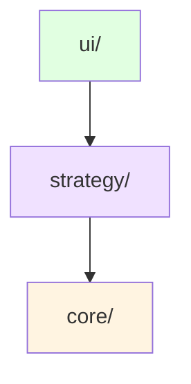

# 井字棋项目架构文档

> **最后更新**: 2024-11-21  
> **文档版本**: v2.0.0

## 📁 目录结构

### 核心原则
1. **游戏逻辑分离**：游戏核心逻辑独立于AI、UI、服务器等
2. **功能模块化**：按功能类型组织文件
3. **可扩展性**：便于添加新功能而不破坏现有结构
4. **一致性**：与项目中其他游戏（黑白棋、麻将）保持一致的规范

## 🗂️ 标准目录结构

```
src/tic-tac-toe/
├── core/                    # 游戏核心逻辑（纯游戏规则，不涉及AI）
│   ├── game.ts             # 游戏核心函数
│   ├── types.ts            # 类型定义
│   └── index.ts            # 核心模块导出
│
├── strategy/                # AI策略和算法
│   ├── agents/             # AI智能体
│   │   ├── random-agent.ts     # 随机策略
│   │   ├── greedy-agent.ts     # 贪心策略
│   │   ├── minimax-agent.ts    # Minimax算法
│   │   ├── defensive-agent.ts  # 防守策略
│   │   └── qlearning-agent.ts  # Q-Learning算法
│   ├── trainers/           # 训练器
│   │   ├── train-qlearning-agent.ts # Q-Learning训练
│   │   └── train-qlearning-logged.ts # Q-Learning训练（带日志）
│   ├── utils/              # 工具函数
│   │   ├── analyze-qtable.ts   # Q表分析
│   │   ├── compare-ai-batch.ts # AI批量比较
│   │   ├── evaluate-agents-batch.ts # 智能体批量评估
│   │   ├── test-tic-tac-toe-ai.ts # AI测试
│   │   └── visualize-strategy.ts # 策略可视化
│   └── index.ts            # 策略模块导出
│
└── ui/                     # 用户界面相关
    └── demo.ts             # 演示程序
```

## 📋 模块说明

### 1. `core/` - 游戏核心逻辑

**职责**：纯游戏规则实现，不涉及AI、UI、网络等

**核心文件**：
- `game.ts`: 游戏核心函数
  - `createBoard()`: 创建空棋盘
  - `getLegalActions()`: 获取合法动作
  - `makeMove()`: 执行落子
  - `checkWinner()`: 检查胜负
- `types.ts`: 游戏相关的类型定义
  - `Player`: 玩家类型（'X' 或 'O'）
  - `Board`: 棋盘状态类型（3x3数组）
  - `Action`: 动作类型（行、列坐标）
- `index.ts`: 核心模块的统一导出

**使用场景**：
- 训练脚本：提供游戏环境进行AI训练
- UI界面：渲染游戏状态和处理用户输入
- 测试脚本：验证游戏逻辑的正确性

**依赖关系**：
- 无外部依赖（除了基础类型）

**最佳实践**：
- 保持核心逻辑的纯净性，不引入 AI 相关代码
- 所有函数应该是纯函数，便于测试
- 游戏状态应该是不可变的，操作返回新状态

### 2. `strategy/` - AI策略和算法

**职责**：所有AI相关的实现

**核心子目录**：
- `agents/`: AI智能体
  - `random-agent.ts`: 随机策略智能体（基准测试用）
  - `greedy-agent.ts`: 贪心策略智能体（选择最优即时收益）
  - `minimax-agent.ts`: Minimax算法智能体（完美策略）
  - `defensive-agent.ts`: 防守策略智能体（优先阻止对手）
  - `qlearning-agent.ts`: Q-Learning算法智能体（强化学习）
- `trainers/`: 训练器
  - `train-qlearning-agent.ts`: Q-Learning训练脚本
  - `train-qlearning-logged.ts`: Q-Learning训练脚本（带详细日志）
- `utils/`: 工具函数
  - `analyze-qtable.ts`: Q表分析工具（分析学习到的策略）
  - `compare-ai-batch.ts`: AI批量比较工具（对比不同AI性能）
  - `evaluate-agents-batch.ts`: 智能体批量评估工具
  - `test-tic-tac-toe-ai.ts`: AI测试脚本
  - `visualize-strategy.ts`: 策略可视化工具（可视化Q表）

**使用场景**：
- 训练脚本：使用 trainers/ 进行Q-Learning训练
- UI界面：使用 agents/ 提供AI对手
- 评估脚本：使用 utils/ 进行性能评估和分析

**依赖关系**：
- 依赖 `core/` 模块获取游戏逻辑

**最佳实践**：
- 保持 agents/ 接口统一，实现 `Agent` 接口
- Q-Learning 智能体应该支持保存和加载Q表
- 使用工具函数进行性能评估和策略分析

### 3. `ui/` - 用户界面

**职责**：用户交互相关的代码

**核心文件**：
- `demo.ts`: 演示程序
  - 快速演示游戏和AI功能
  - 支持人机对弈和AI对弈

**使用场景**：
- 终端用户：通过 demo 进行游戏
- 开发者：快速测试功能
- 演示：展示游戏和AI功能

**依赖关系**：
- 依赖 `core/` 模块获取游戏逻辑
- 依赖 `strategy/` 模块获取AI智能体

**最佳实践**：
- UI 层应该薄，主要逻辑在 core/ 和 strategy/
- 提供清晰的用户反馈

## 🔗 依赖关系



**依赖说明**：
- `core/` 提供游戏核心逻辑，被 `strategy/` 和 `ui/` 使用
- `strategy/` 提供AI策略，被 `ui/` 使用

**依赖方向**：`ui/ → strategy/ → core/`（单向依赖，避免循环）

## 📋 文件清单

> **注意**：此列表由脚本自动生成，最后更新于 2025-11-21
> 
> 如需更新，请运行：`npm run docs:update-file-list`

### core/

- `core/game.ts` ✅
- `core/index.ts` ✅
- `core/types.ts` ✅

### strategy/

- `strategy/agents/defensive-agent.ts` ✅
- `strategy/agents/greedy-agent.ts` ✅
- `strategy/agents/minimax-agent.ts` ✅
- `strategy/agents/qlearning-agent.ts` ✅
- `strategy/agents/random-agent.ts` ✅
- `strategy/index.ts` ✅
- `strategy/trainers/train-qlearning-agent.ts` ✅
- `strategy/trainers/train-qlearning-logged.ts` ✅
- `strategy/utils/analyze-qtable.ts` ✅
- `strategy/utils/compare-ai-batch.ts` ✅
- `strategy/utils/evaluate-agents-batch.ts` ✅
- `strategy/utils/test-tic-tac-toe-ai.ts` ✅
- `strategy/utils/visualize-strategy.ts` ✅

### ui/

- `ui/demo.ts` ✅


## 📊 实际结构验证

本文档最后更新于：2024-11-21  
实际文件结构已验证：✅

**验证内容**：
- ✅ 所有目录结构符合文档描述
- ✅ strategy/ 子目录已创建（agents/, trainers/, utils/）
- ✅ strategy/index.ts 已创建
- ✅ 所有文件已移动到正确位置
- ✅ 导入路径已更新
- ✅ 架构符合项目统一规范

## 🔗 相关文档

### 项目文档
- [项目整体架构](../ARCHITECTURE.md) - 了解整体架构规范
- [架构迁移指南](../ARCHITECTURE.md#架构迁移指南) - 添加新游戏时的参考

### 其他游戏
- [黑白棋架构文档](../othello/FOLDER_STRUCTURE.md) - 参考规范的游戏架构（多种AI算法、完整训练框架）
- [麻将架构文档](../majiang/FOLDER_STRUCTURE.md) - 参考复杂游戏的架构（复杂规则、多阶段训练）

### 使用指南
- [MVP用户指南](./MVP_USER_GUIDE.md) - 快速上手井字棋开发

